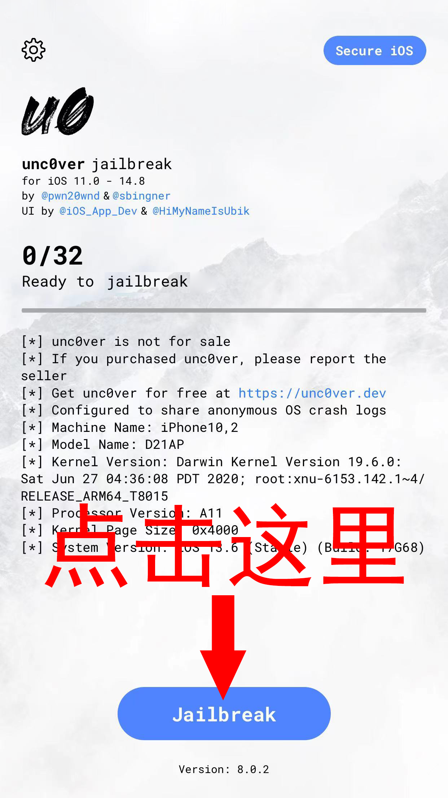
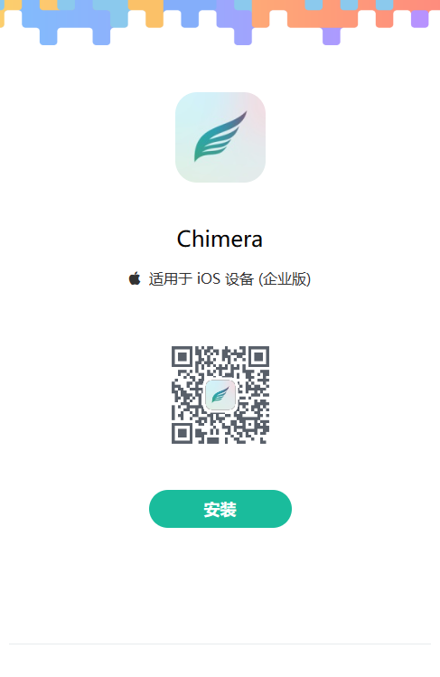
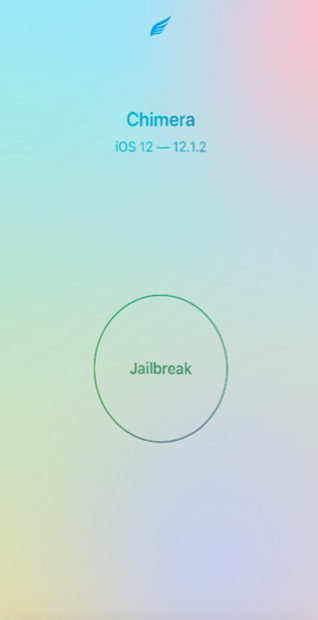
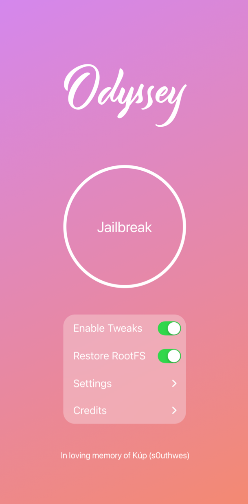
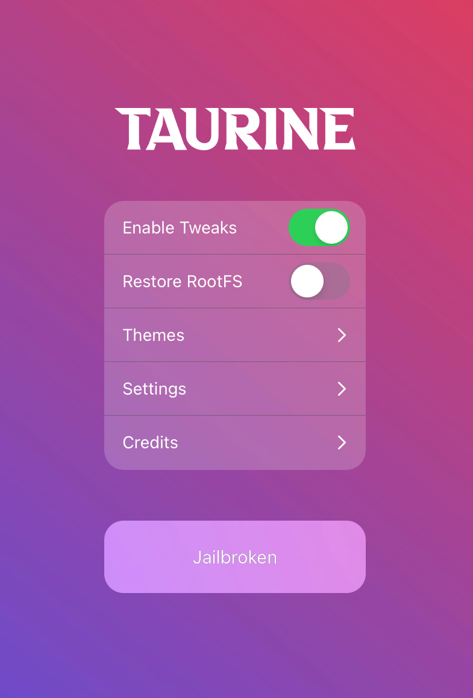
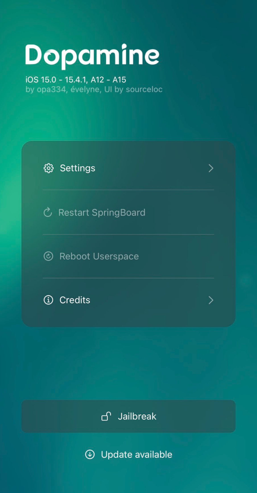

# 使用uncOver进行越狱(推荐)
uncOver支持iOS/iPadOS 11-14.8版本，全部设备类型。
1. 打开uncOver下载地址：https://www.pgyer.com/qFYrTR

2. 点击安装

3. 打开设置->通用->描述文件与设备管理(V*N与设备管理)->点击信任

4. 返回桌面，打开桌面上的uncOver软件

5. 此时插上电源，点击下方Jailbreak按钮即可。(不成功可再次点击)

# 使用Chimera进行越狱
Chimera支持iOS/iPadOS 12.2-12.5.7，全部设备类型。
1. 打开Chimera下载地址：https://www.pgyer.com/UC1gM2

2. 点击安装

3. 打开设置->通用->描述文件与设备管理(V*N与设备管理)->点击信任

4. 返回桌面，打开桌面上的uncOver软件

5. 此时插上电源，点击屏幕中间Jailbreak按钮即可。(不成功可再次点击)

# 使用Odyssey进行越狱
Odyssey支持iOS/iPadOS 13.0-13.7，全部设备类型。
1. 打开Odyssey下载地址：https://www.pgyer.com/4YEh0U

2. 点击安装

3. 打开设置->通用->描述文件与设备管理(V*N与设备管理)->点击信任

4. 返回桌面，打开桌面上的uncOver软件

5. 此时插上电源，点击屏幕中间Jailbreak按钮即可。(不成功可再次点击)

# 使用Taurine进行越狱
Taurine支持iOS/iPadOS 14.0-14.8.1，全部设备类型。
1. 打开Taurine下载地址：https://www.pgyer.com/AUgnW2

2. 点击安装

3. 打开设置->通用->描述文件与设备管理(V*N与设备管理)->点击信任

4. 返回桌面，打开桌面上的uncOver软件

5. 此时插上电源，点击下方Jailbreak按钮即可。(不成功可再次点击)

# 使用Dopamine进行越狱
Dopamine支持iOS/iPadOS 15.0-15.4.1，全部设备类型。
1. 打开Dopamine下载地址：https://www.pgyer.com/4pbTLq

2. 点击安装

3. 打开设置->通用->描述文件与设备管理(V*N与设备管理)->点击信任

4. 返回桌面，打开桌面上的uncOver软件

5. 此时插上电源，点击下方Jailbroken按钮即可。(不成功可再次点击)

